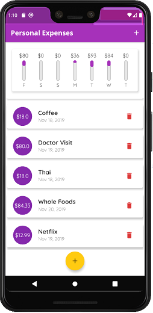

Flutter-Expence-Tracking-app
==
This repository is a expence tracking apllication created using Flutter. The user is able to manually add each transaction, and there is a chart demonstrating the spending distribution within 7 days. The user is able to remove the transactions as well.

## Dependencies
```yaml
dependencies:
  intl: ^0.15.8
```
## Versioning
Version 1.0 (First deployment)
## Screenshot

## Issues
* Keyboard will cause pixels to be out of bounds on some phones
* All transaction will not be saved after restarting the app

## To do list
* Method to sort each transaction.
* Cloud storage for data 
* App icon 


## License

The contents of this repository are covered under the [MIT](LICENSE) License.

## Acknowledgments
Maximilian Schwarzmüller's [Udemy Course](https://www.udemy.com/course/learn-flutter-dart-to-build-ios-android-apps/).

